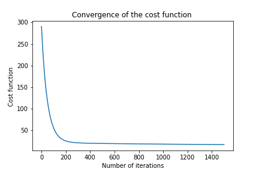
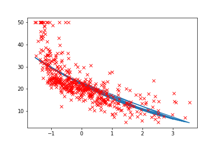

# Implementing quadratic regressoin using gradinet descent
This is the convergence of loss as we increase the number of iterations 

The fitted line for the quadratic model and given points is : 

